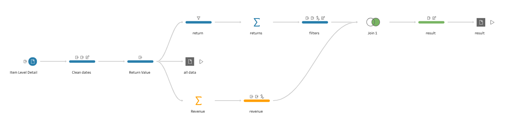
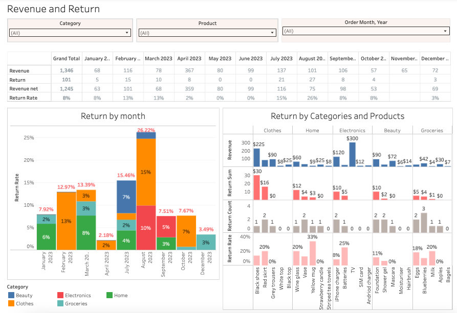
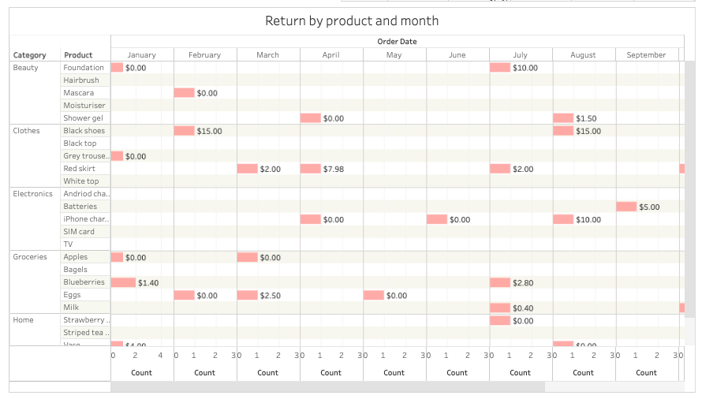

# Returns Analysis & Operational Dashboard (Tableau Prep + Tableau Desktop/ Tableau Public)

🔗 **[Live Interactive Dashboard on Tableau Public](https://public.tableau.com/app/profile/ann.ign/viz/Returns_17780584320870/Dashboard1?publish=yes)** 

An end-to-end analytics solution built to monitor retail product returns, identify sudden refund spikes, and protect net revenue. The project combines an ETL pipeline in **Tableau Prep** with an interactive **Tableau Desktop** monitoring system.

---

## Business Overview & Problem Statement
High refund rates directly affect cash flow and net revenue. Without a structured monitoring system, managers lack historical context to determine whether a current month's return rate is a normal operational fluctuation or a critical anomaly requiring immediate action.

This project introduces an **"Early Warning System"**:
1. **High-Level Monitoring:** Tracking overall net revenue and refund trends in real time.
2. **Deep-Dive Root Cause Analysis:** Allowing category managers to instantly drill down into anomalous months, specific categories, or individual products to address quality or logistics issues.

---

## Data Pipeline & Business Logic (Tableau Prep)

The underlying data contained raw sales and return logs with date alignment issues and missing policy rules. I built a multi-branch ETL workflow in **Tableau Prep** to clean and structure the data before visualization:

* **Data Cleaning & Date Logic Fix:** Solved a source system bug where sale and return dates were chronologically reversed.
* **Tiered Refund Policy:** Implemented calculated fields to apply a custom refund logic (100%, 50%, or 0% refund) based on how quickly the product was returned.
* **Data Modeling & Branching:** Created dedicated aggregated outputs to support both executive-level monthly metrics and granular product-level analysis (`Join` & `Aggregation` steps).

---

## Dashboard Architecture & Operational Logic

The dashboard is structured like a diagnostic funnel — moving from a high-level status check to deep operational analysis:

### 1. High-Level Health Check (Executive Summary)
* **Summary Table & Monthly Trend Chart (Left):** Designed for quick status checks. Allows stakeholders to immediately spot performance shifts, track net revenue, and monitor whether total refund rates are within normal ranges or spiking.

### 2. Category & Product Deep-Dive (Category Managers)

* **Anomalies & Baseline Comparison:** Provides historical context to evaluate whether return spikes are isolated incidents or recurring seasonal patterns.
* **Detailed Matrix:** Combines Revenue, Return Value, Return Count, and Return Rate (%) to prioritize operational risks:
  * **High-Value Returns:** Tracks expensive single-item refunds to protect revenue net.
  * **High-Volume Returns:** Flags low-cost items with high return quantities. High return volume often signals systemic operational risks — such as defective supplier batches, poor packaging, or transit damage — helping the team decide whether to drop problematic SKUs to protect brand reputation.

---

## Key Business Insights

* **August Refund Spike Detected:** The system successfully flagged a massive anomaly in August 2023, where the refund rate jumped to **26.22%** (compared to the ~8% yearly average).
* **Category Bottlenecks:** Drilling down into the August anomaly showed that the **Home** and **Electronics** categories generated the majority of return costs.
* **Actionable Outcome:** Category managers can immediately audit specific supplier batches and logistics delivery quality for those two product groups, preventing similar financial leaks in the future.

---

## Tech Stack & Methodology
* **Tableau Prep Builder:** Data cleaning, date logic transformation, custom business rules, and multi-branch ETL pipelines.
* **Tableau Desktop / Tableau Public:** Interactive dashboard design, drill-down parameters, and action filters.
* **Data Source & Scope:** Built as a **Proof of Concept (PoC)** using transaction logs based on the *Preppin' Data* challenge framework. The data pipeline and dashboard logic are production-ready and fully scalable to real-world e-commerce data warehouses.

